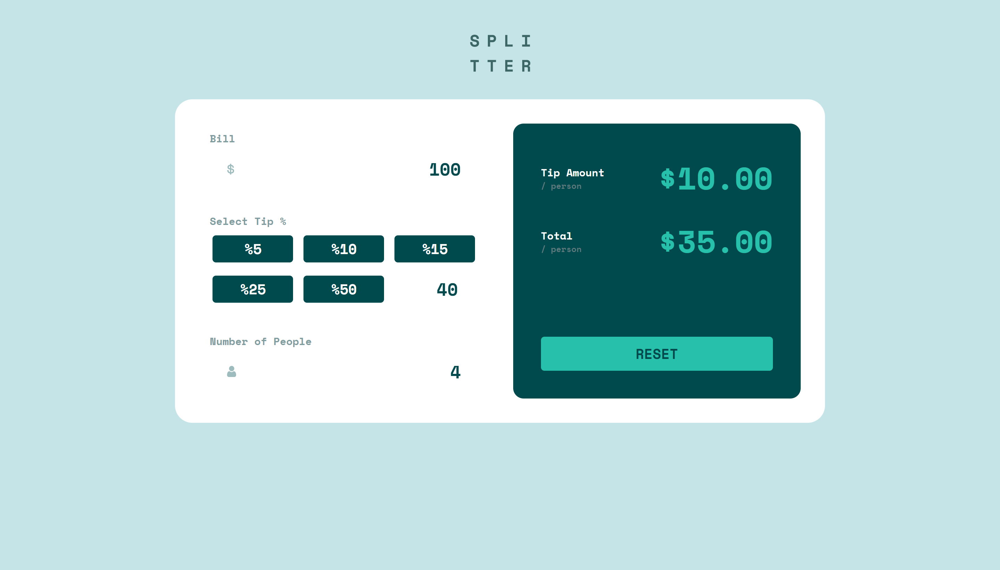
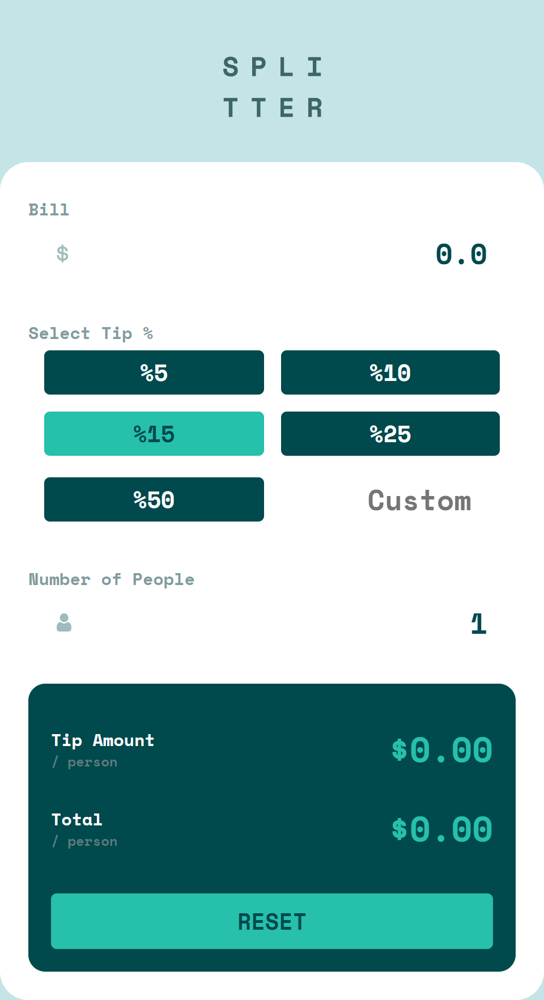
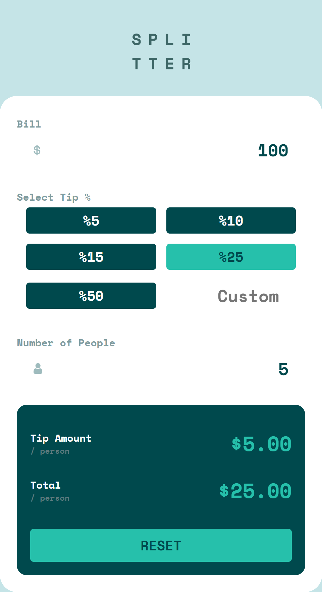
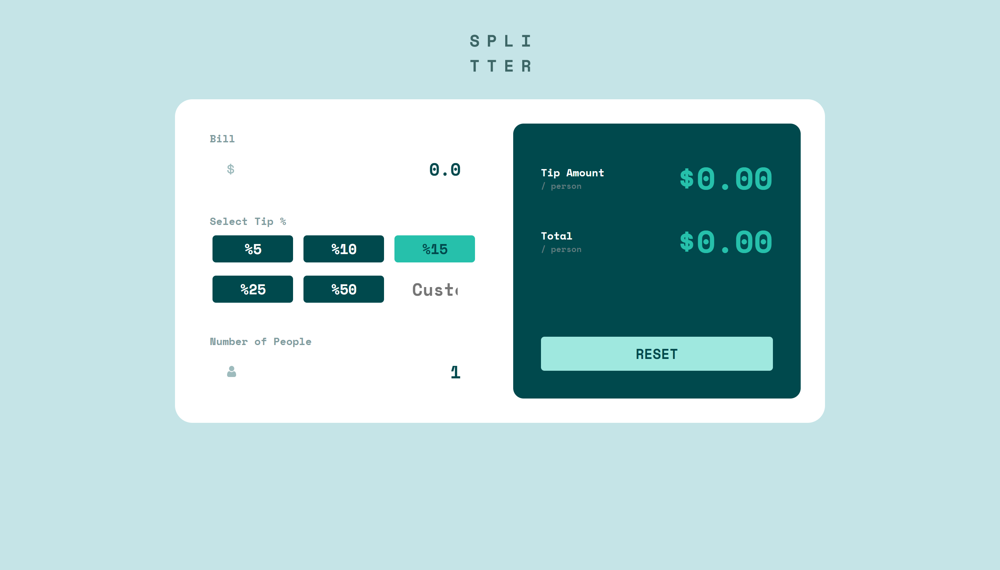

# Frontend Mentor - Tip calculator app

The challenge is to build out this tip calculator app and get it looking as close to the design as possible.

## Table of contents

- [Overview](#overview)
  - [The challenge](#the-challenge)
  - [Screenshot](#screenshot)
  - [Links](#links)
  - [Built with](#built-with)
  - [Useful resources](#useful-resources)

## Overview

### The challenge

Users should be able to:

- View the optimal layout for the app depending on their device's screen size
- See hover states for all interactive elements on the page
- Calculate the correct tip and total cost of the bill per person

### Screenshot

#### Mobile view screenshots

#### Before calculation

#### After calculation

#### Desktop view screenshots

#### Before calculation

#### After calculation

### Links

- Solution URL: [Add solution URL here](https://your-solution-url.com)
- Live Site URL: [Add live site URL here](https://your-live-site-url.com)

### Built with

- Semantic HTML5 markup
- CSS custom properties
- Flexbox
- JavaScript HTML DOM

### Useful resources

- [HTML](https://www.w3schools.com/html/default.asp)
- [CSS](https://www.w3schools.com/css/default.asp)
- [Flexbox](https://www.w3schools.com/css/css3_flexbox.asp)
- [JavaScript HTML DOM - mdn web docs](https://developer.mozilla.org/en-US/docs/Web/API/Document_Object_Model)
- [JavaScript HTML DOM - w3schools](https://www.w3schools.com/js/js_htmldom.asp)
